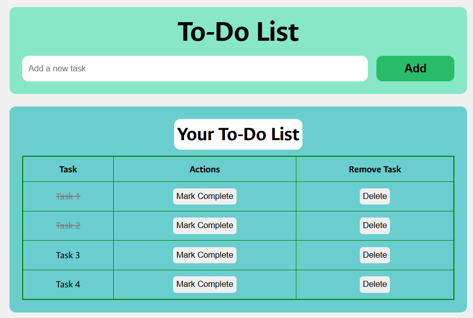

# 📝 To-Do List Web App

A clean, responsive, and interactive To-Do List web application built using **HTML**, **CSS**, and **JavaScript**. Users can add, mark as complete, and delete tasks—all without page reloads.

---

## 🚀 Features

- ✅ Add new tasks using an input form
- ✅ Mark tasks as completed using a complete button
- ✅ Delete tasks from the list
- ✅ Visual indication of completed tasks (line-through)
- ✅ Fully responsive and modern design

---

## 📸 Preview

---

## 🛠️ Technologies Used

- **HTML5** – Structure of the app
- **CSS3** – Styling and layout
- **JavaScript (Vanilla)** – DOM manipulation and event handling
- **Google Fonts** – Custom font (Ancizar Sans)

---

## 🧩 Folder Structure
project/  
├── index.html  
├── style.css  
├── script.js  
└── README.md  

## 🔗 Live Demo

Check out the live demo here:  
👉 [To-Do List Demo](https://archiep27.github.io/TO-DO-LIST/)

